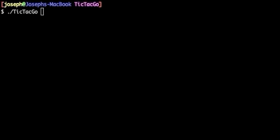

<h1 align="center">TicTacGo</h1>



## Install

```shell
go get github.com/josephthomashines/TicTacGo

cd ~/go/src/github.com/josephthomashines/TicTacGo

go build

# Run in interactive mode
./TicTacGo

# Run n simulations
./TicTacGo n
```

## Checklist

| Status |                               Feature                                |
| :----: | :------------------------------------------------------------------: |
|   ✅   |                   Allow for CLI input to play game                   |
|   ✅   |                    Error checking for user input                     |
|   ❌   | Create a way to simulate games and report win-rates and game lengths |
|   ❌   |                Use goroutines to speed up simulation                 |
|   ❌   |                            Add unit tests                            |
